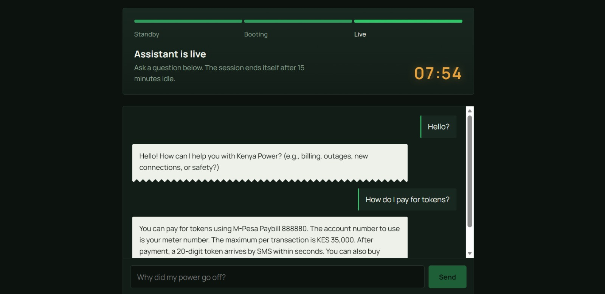

# KPLC Chatbot System



A support chatbot for Kenya Power (KPLC) customers, built as seven
cooperating services rather than one monolith: a gateway, two frontends, a
GPU inference service, a dataset sync pipeline, a knowledge-base builder,
and a managed database layer.

## Try it live

https://kplc-chatbot-frontend.vercel.app/

Note: the chatbot runs inference on a Kaggle GPU notebook that starts on demand rather than staying always-on (this is what keeps hosting cost near zero). The first message after a period of inactivity takes about 3 minutes to boot the notebook before it responds. Every message after that is fast.

## Why this exists

KPLC customers ask repetitive support questions (token purchases, outage
reports, billing). This system answers them with a retrieval-augmented
chatbot, while keeping GPU inference cost near zero by running the model
on a Kaggle-hosted notebook that starts on demand instead of a paid GPU
host.

## Architecture

```
kplc-chatbot-web (Vercel)    -----+
                                   +--> kplc-chatbot-gateway --+--> kplc-chatbot-inference (Kaggle GPU notebook)
kplc-chatbot-admin (Netlify) -----+                            +--> kplc-chatbot-dataset-sync (Kaggle from Hugging Face)
                                                                 +--> kplc-chatbot-db-infra (MongoDB Atlas)
```

Request flow: a user question hits the gateway, which confirms the model
dataset exists on Kaggle (triggering a sync from Hugging Face if not),
starts the Kaggle notebook if it is not already running, then proxies the
question through for retrieval and generation. Session and chunk state
live in MongoDB Atlas so a restart never loses in-flight work.

## Services

| Repo | Role | Live |
|---|---|---|
| [kplc-chatbot-web](https://github.com/wycliffearapcheruiyot/kplc-chatbot-web) | the chatbot UI end users talk to | - |
| [kplc-chatbot-admin](https://github.com/wycliffearapcheruiyot/kplc-chatbot-admin) | the admin panel for managing the bot | - |
| [kplc-chatbot-gateway](https://github.com/wycliffearapcheruiyot/kplc-chatbot-gateway) | the API gateway that routes every request | - |
| [kplc-chatbot-inference](https://github.com/wycliffearapcheruiyot/kplc-chatbot-inference) | the service that runs the model on a Kaggle GPU | - |
| [kplc-chatbot-dataset-sync](https://github.com/wycliffearapcheruiyot/kplc-chatbot-dataset-sync) | the service that keeps the model dataset current on Kaggle | - |
| [kplc-chatbot-kb-builder](https://github.com/wycliffearapcheruiyot/kplc-chatbot-kb-builder) | the tooling that builds the chatbot knowledge base | - |
| [kplc-chatbot-db-infra](https://github.com/wycliffearapcheruiyot/kplc-chatbot-db-infra) | the shared MongoDB Atlas configuration | - |

All repos also share the "kplc-chatbot-system" topic tag:
https://github.com/wycliffearapcheruiyot?tab=repositories&q=topic%3Akplc-chatbot-system

## Tech stack

- Backend: Python, FastAPI, MongoDB Atlas
- Frontend: Next.js, React, Vite
- Infra: Render, Vercel, Netlify, Kaggle GPU notebooks, Hugging Face
- Model: Qwen3-4B-Instruct - https://huggingface.co/wycliffearapcheruiyot/Qwen3-4B-Instruct-2507

## Skills demonstrated

- Designing a multi-service system with clear ownership boundaries
- Cost-conscious infra: on-demand free-tier GPU instead of a paid host
- Resilient orchestration: session state survives restarts, dataset sync
  is idempotent, cold starts are handled gracefully
- Retrieval-augmented generation over a domain-specific knowledge base

## Author

[wycliffearapcheruiyot](https://github.com/wycliffearapcheruiyot)
